# Personal-Assistant Focus on Budget

####EasyBudget is a **Personal Assistant** budget management Android application.
## **Captured images Walkthrough**:
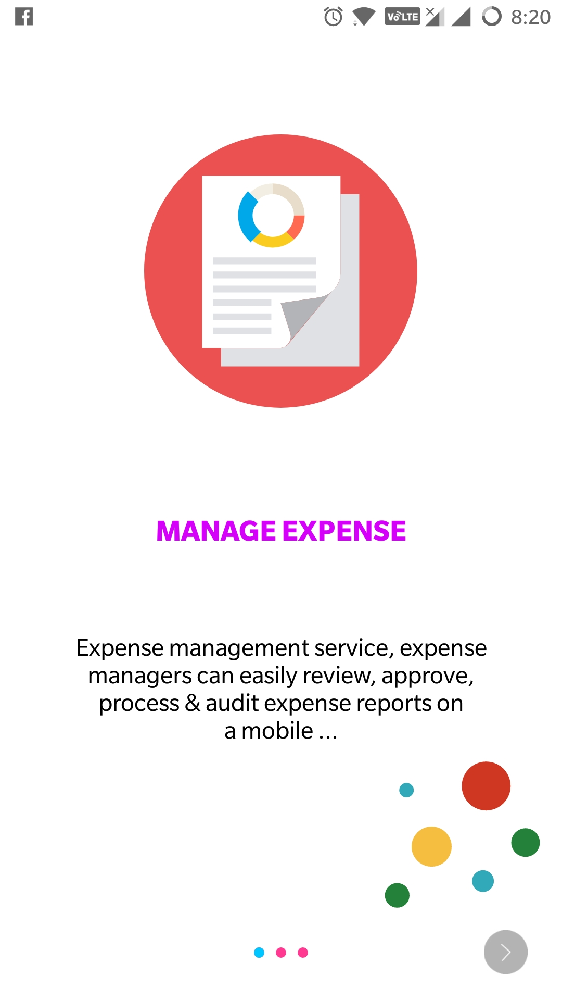 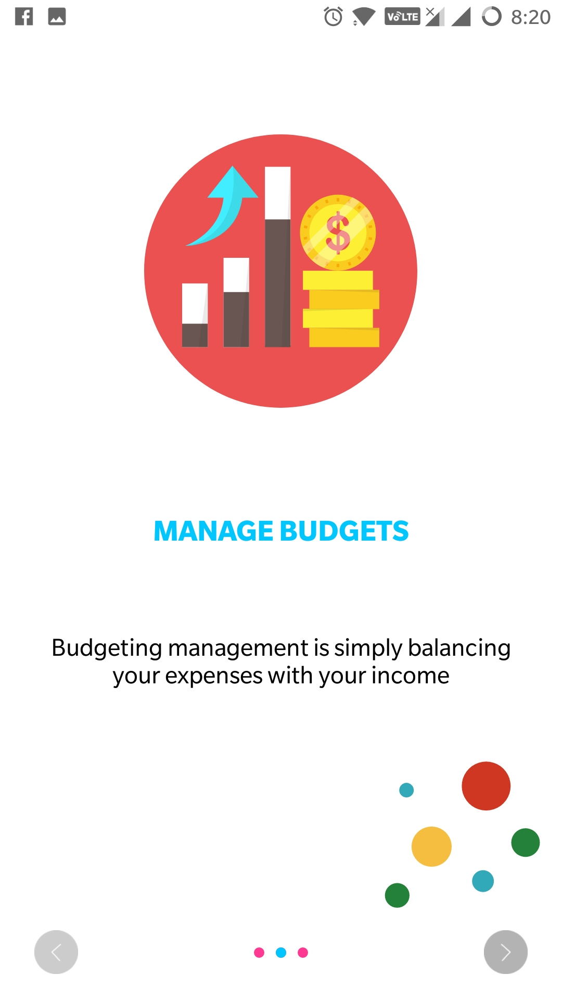 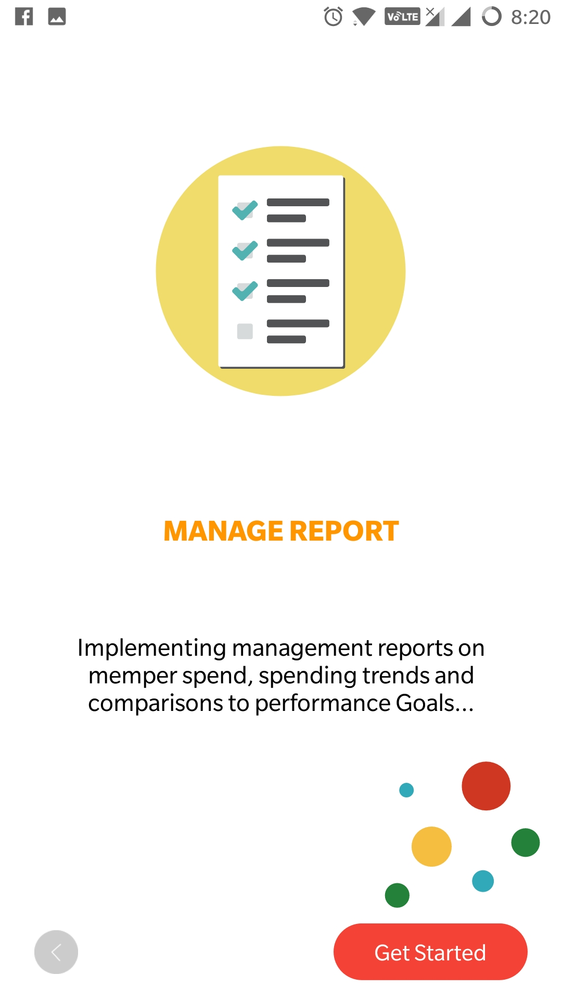
 
 
 
## **Captured images UserManagement**:
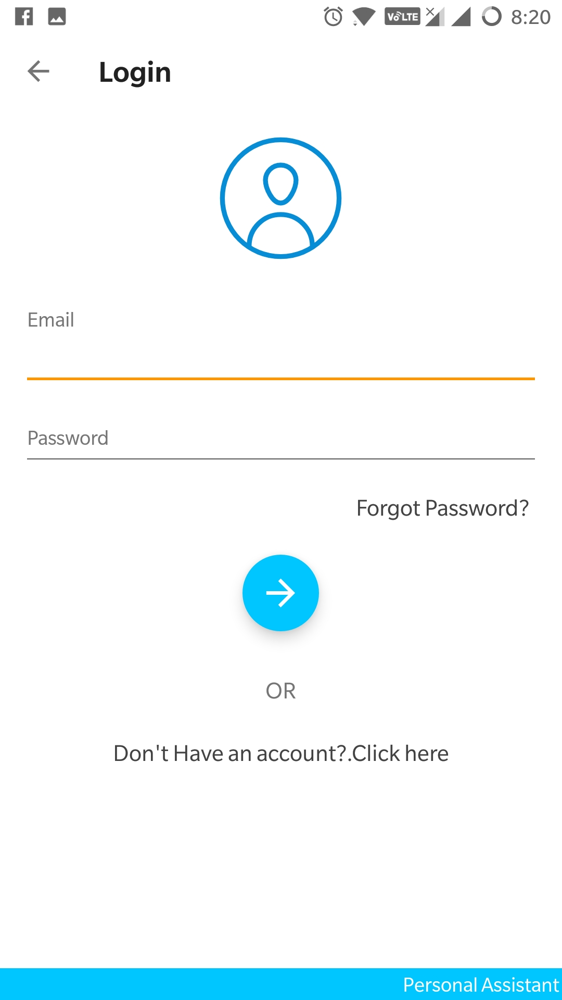 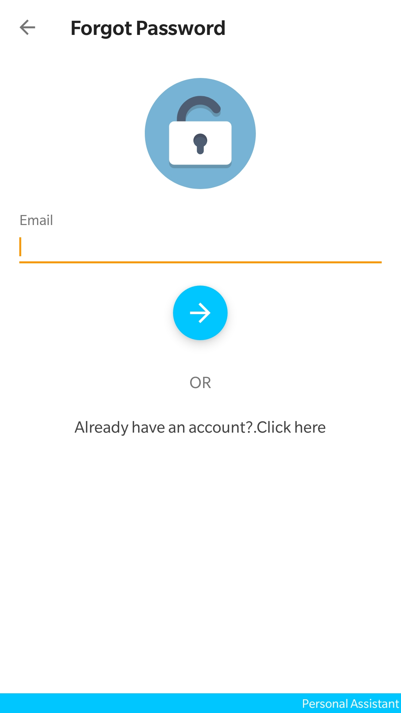 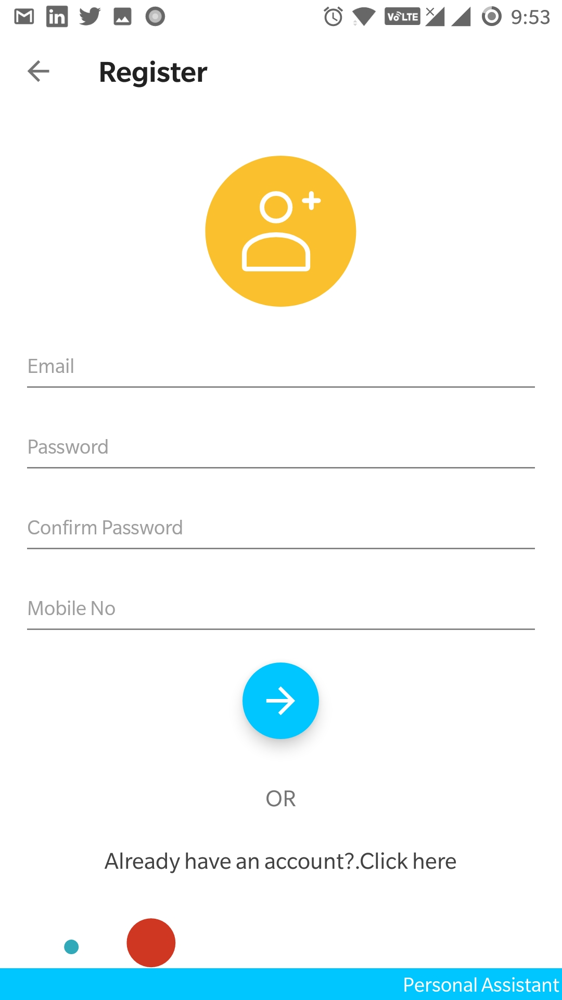

 
 
 

## **Captured images Add Income**:
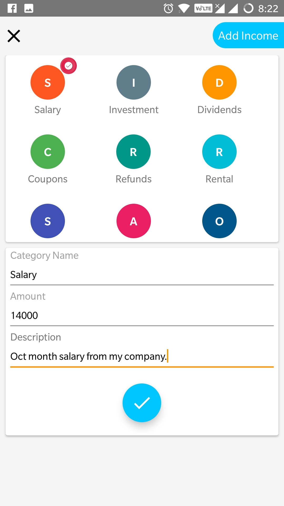 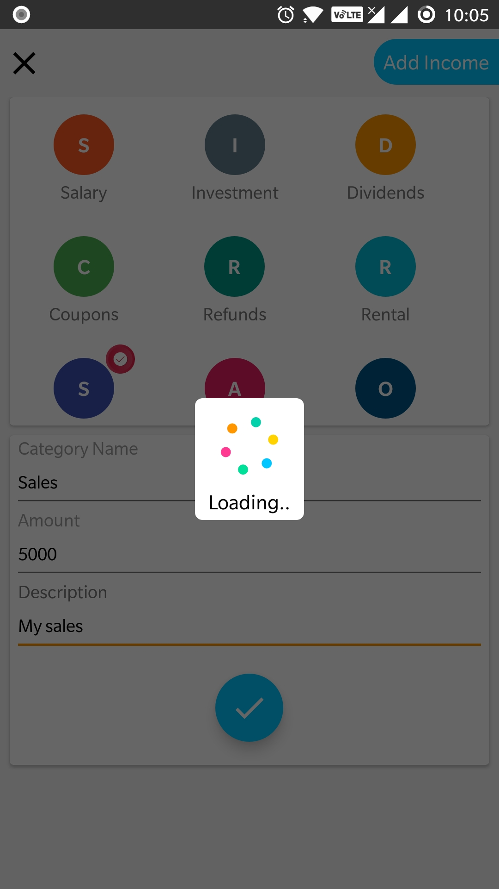 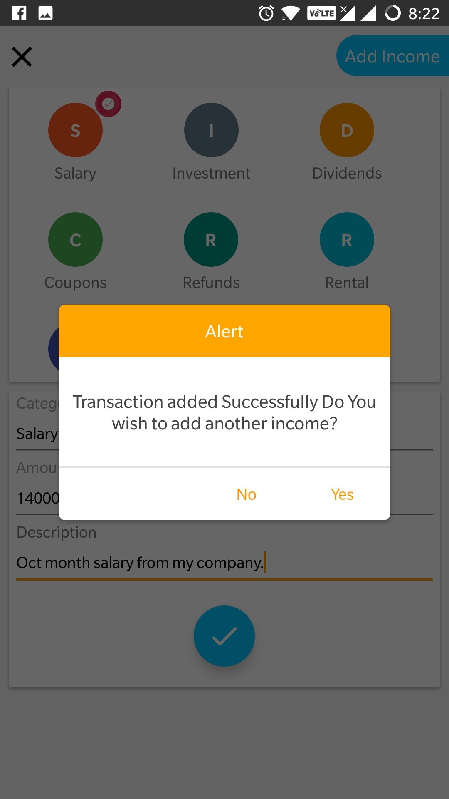

 
 
 

## **Captured images Add/Remove Income Dashboard**:
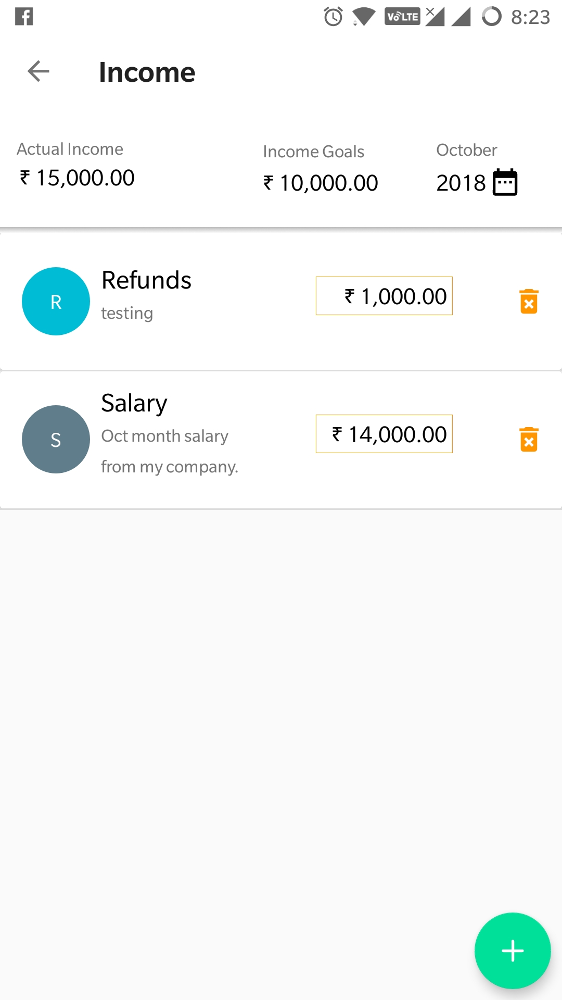 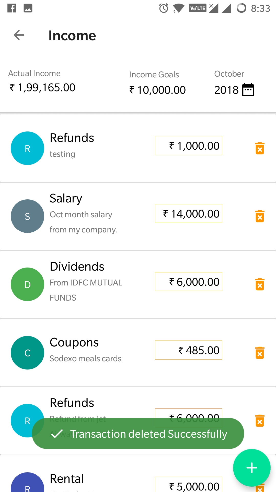 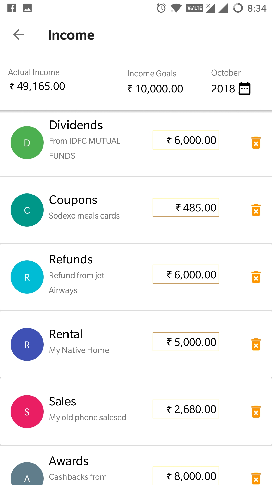

 
 
 

## **Captured images Dashboard Management**:
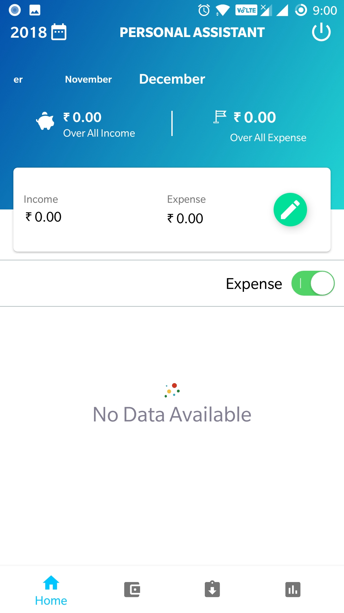 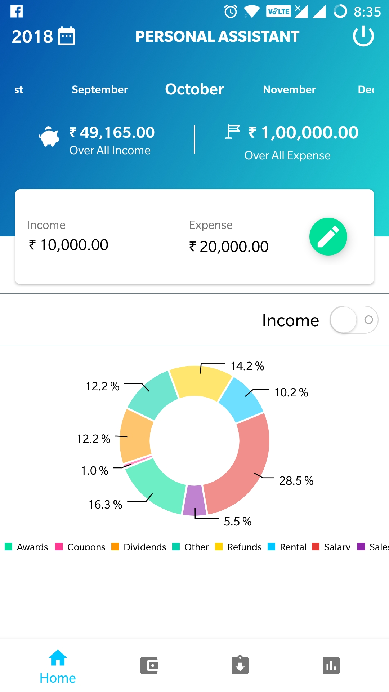 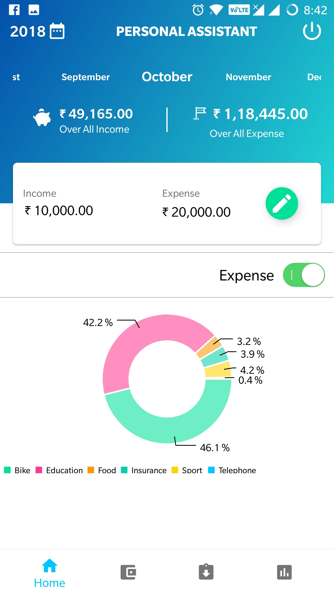
 
 
 

## **Captured images Reports Management**:
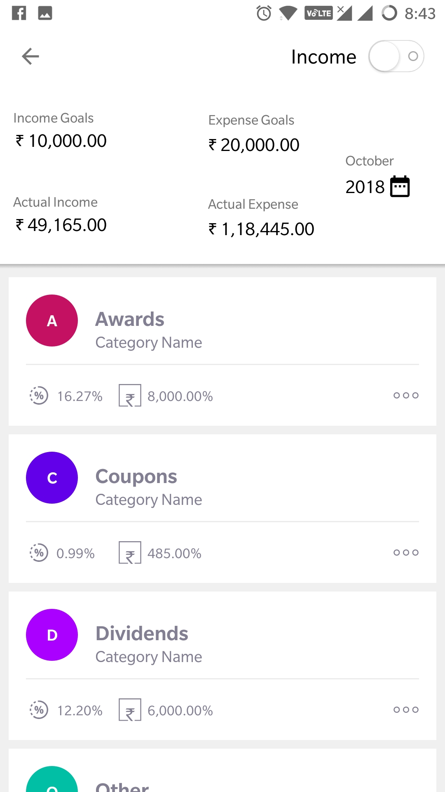 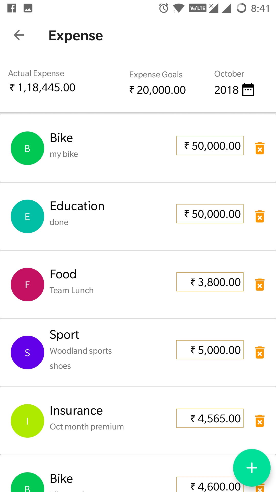 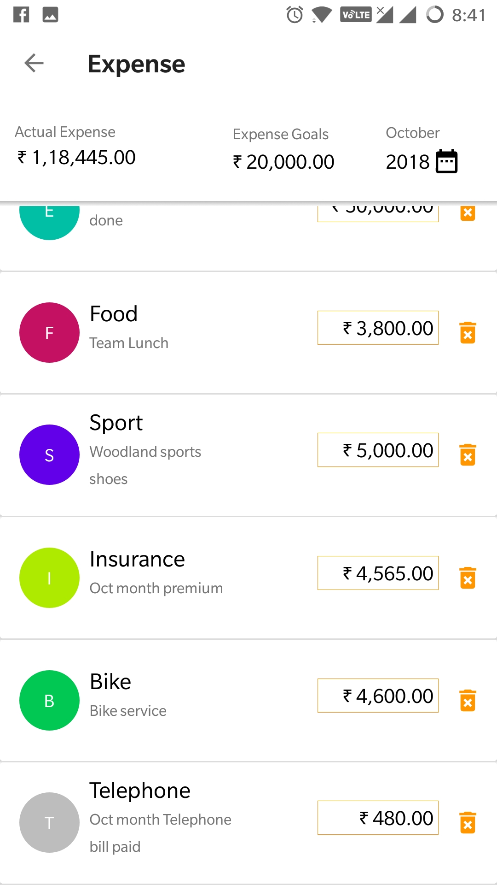
 
 
 
## Technical details
 - `Personal-Assistant is a simple Android app build with Android Studio that supports from Android 5.0.`
 - `The app adopt material design as much as possible using appcompat and some imagination/magic.`

 - The project is made possible by some external libraries made by awesome guys that I want to thanks here:
 - MPAndroidChart: a library to display a customizable Chart [https://github.com/PhilJay/MPAndroidChart])
 
 ## Contact

You can contact me regarding Personal-Assistant application using this email: [ananthramasamy@hotmail.com](mailto:ananthramasamy@hotmail.com)
