## Personal Assistant App for Expense & budget Management

#### Index
 - App Intro
 - User Authentication Management 
 - Dashboard
 - Managing Income
 - Managing Expense
 - Reports
##

#### App Intro
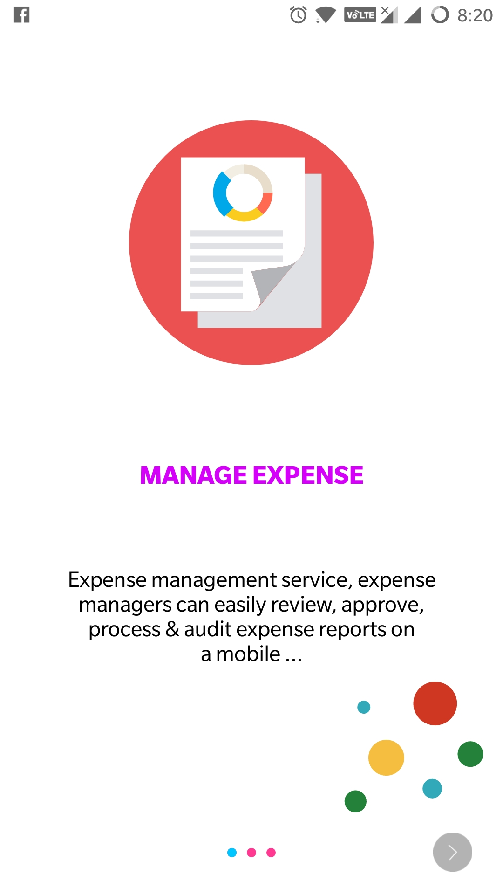 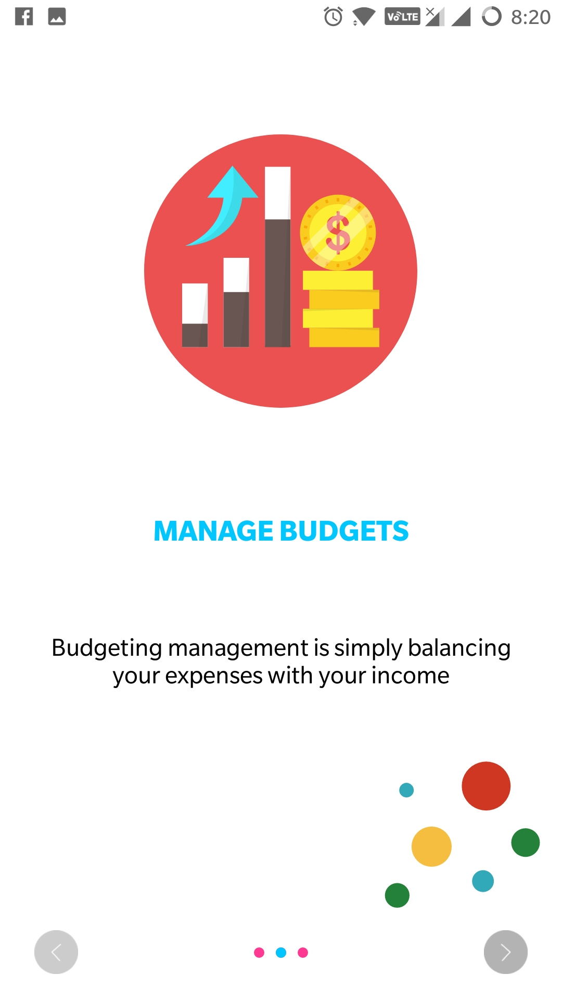 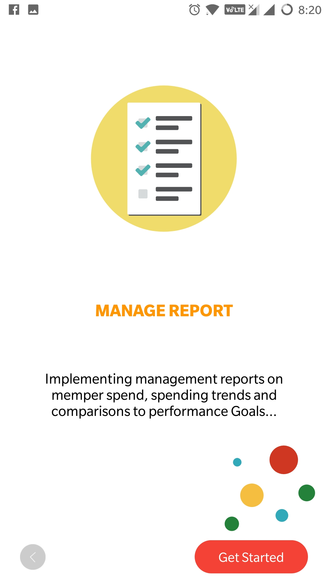

##

#### User Authentication Management
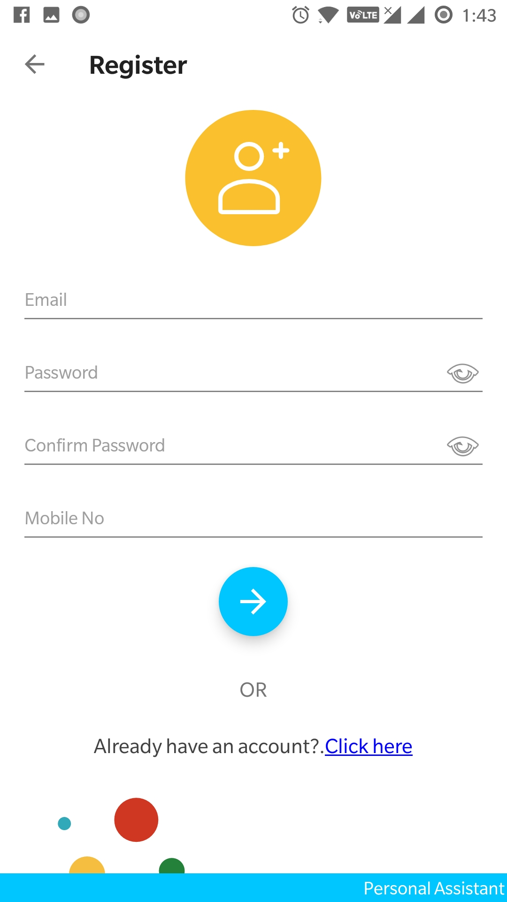  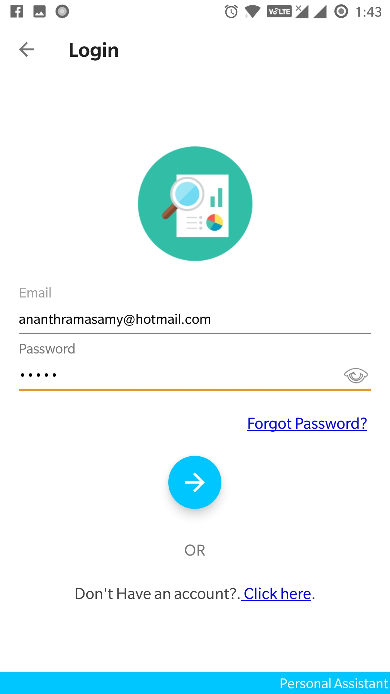

##

#### Dashboard
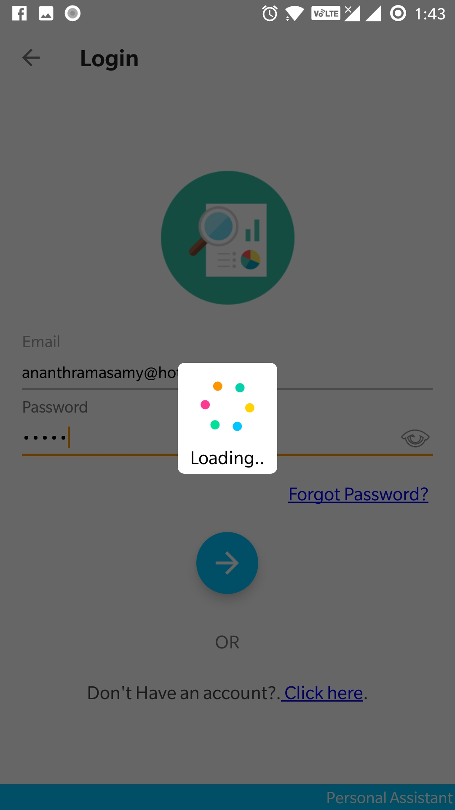 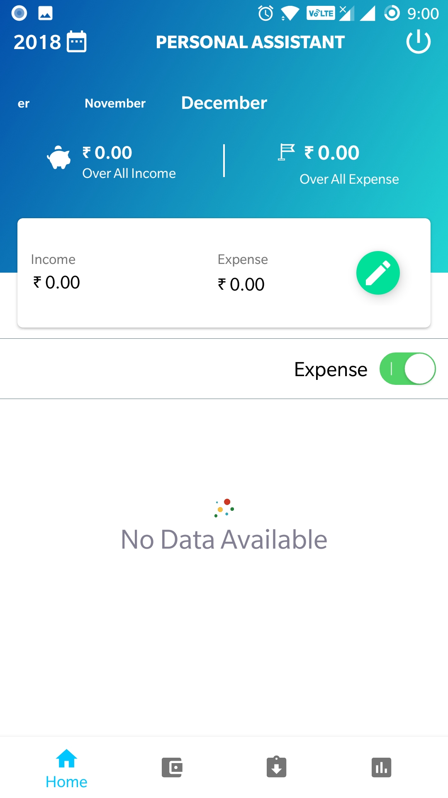 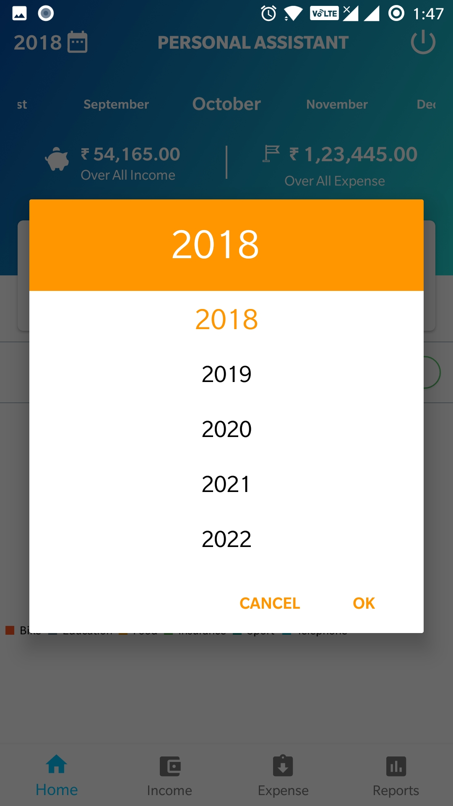

##

- #### Goals Management
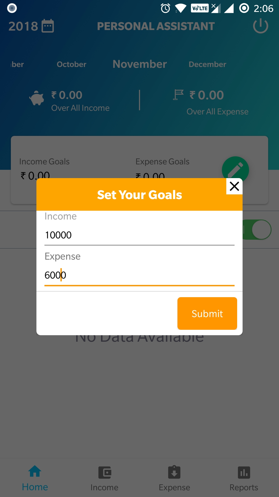 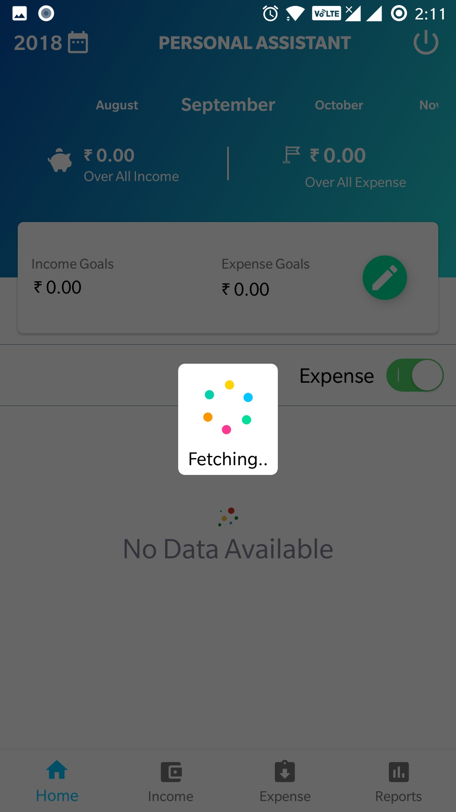 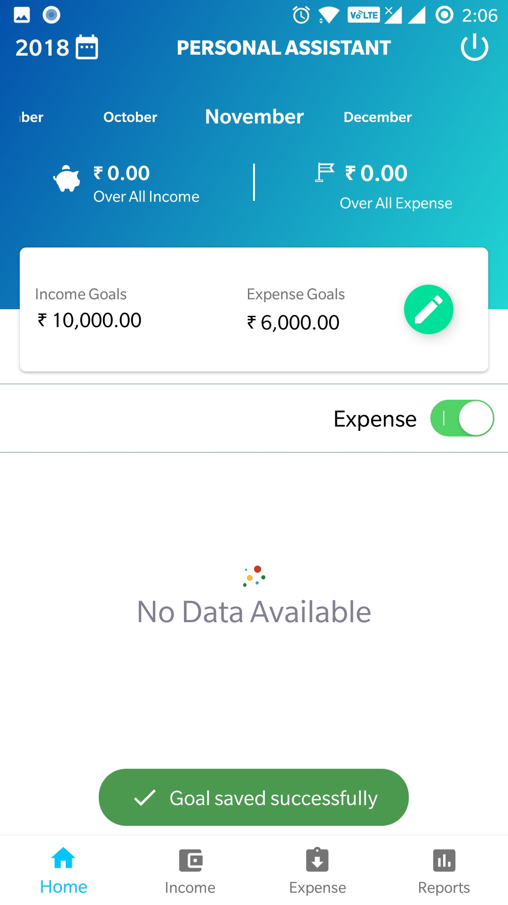

##

#### Managing Income
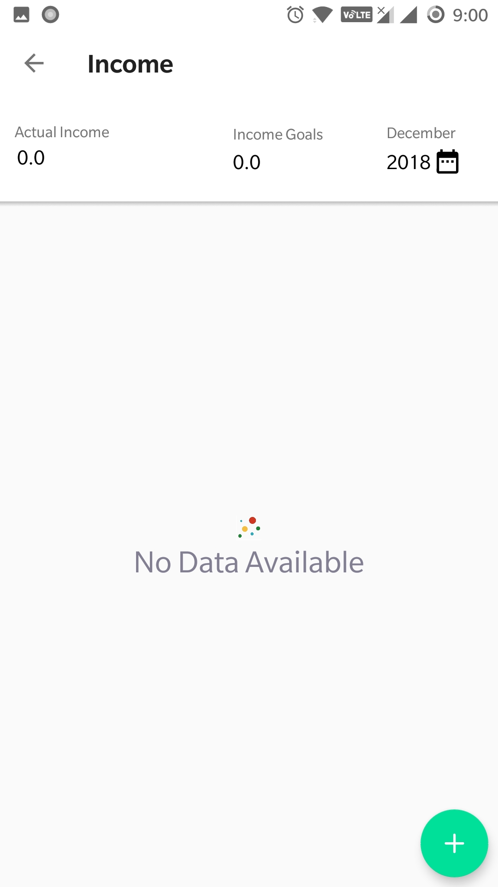  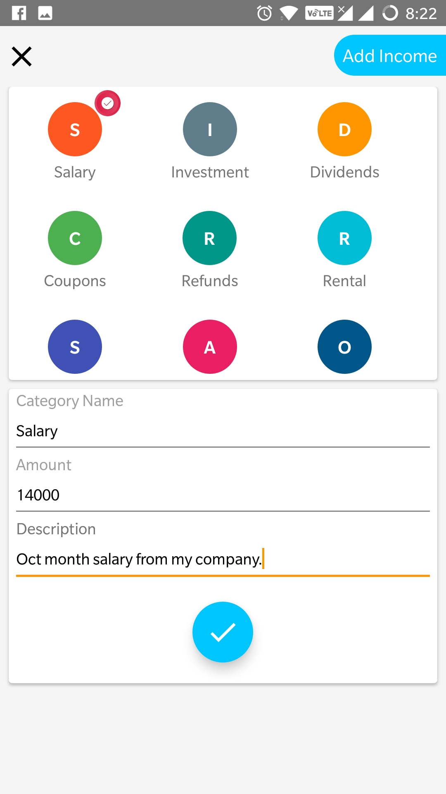 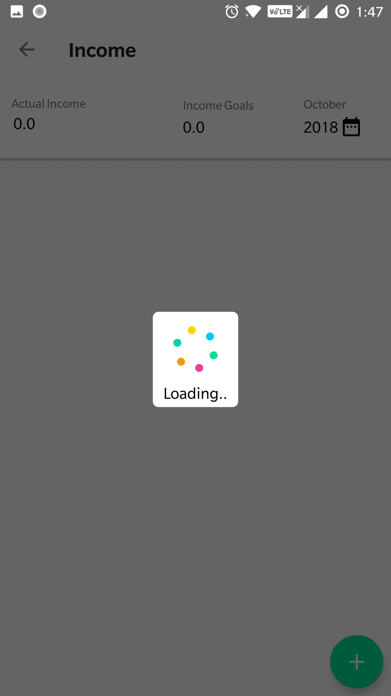  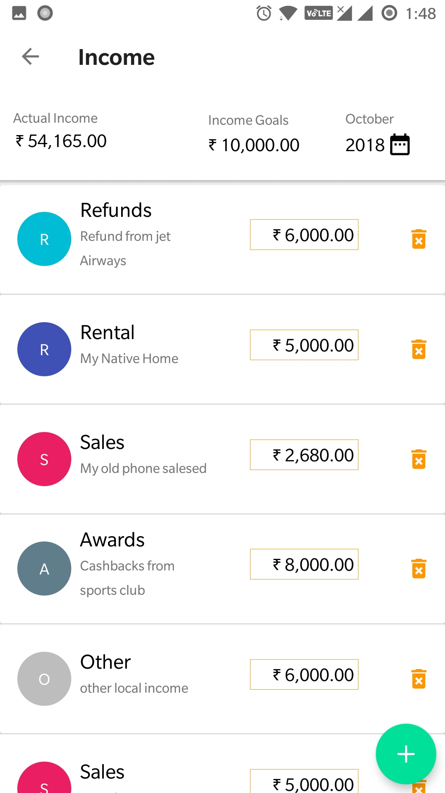 

##

#### Managing Expense
   

##

#### Reports
 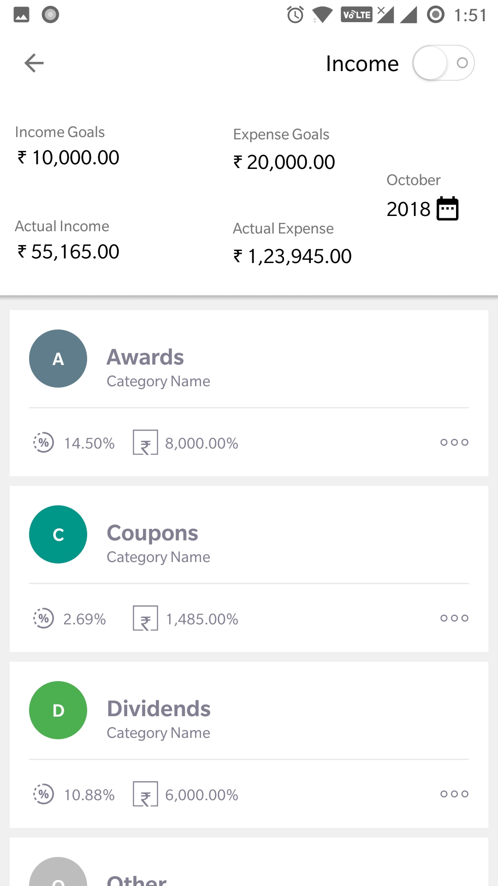 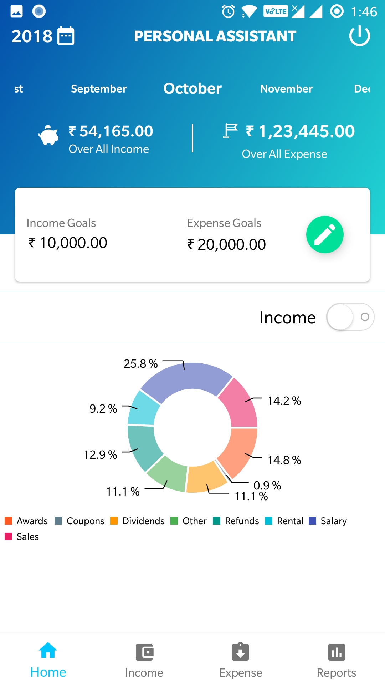 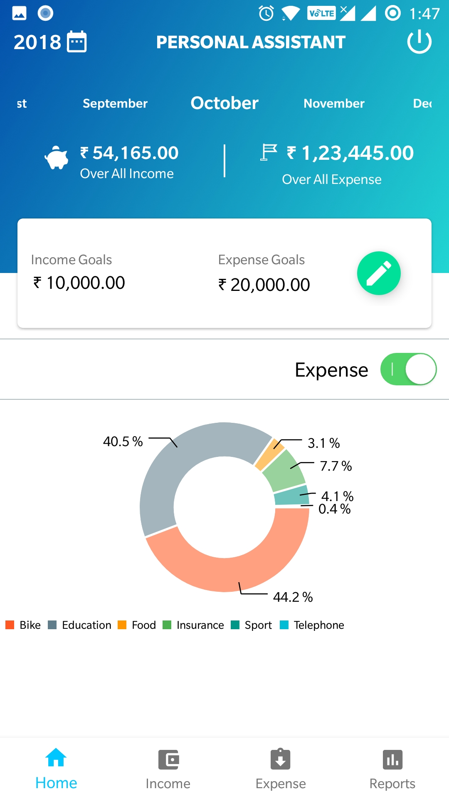 
 
 
 ##

#### Technical details
 - `Personal-Assistant is a simple Android app build with Android Studio that supports from Android 5.0.`
 - `The app adopt material design as much as possible using appcompat and some imagination/magic.`

 - The project is made possible by some external libraries made by awesome guys that I want to thanks here:
 - MPAndroidChart: a library to display a customizable Chart [https://github.com/PhilJay/MPAndroidChart])
 
 
 ##
 
 #### Contact

You can contact me regarding Personal-Assistant application using this email: [ananthramasamy@hotmail.com](mailto:ananthramasamy@hotmail.com)

##
