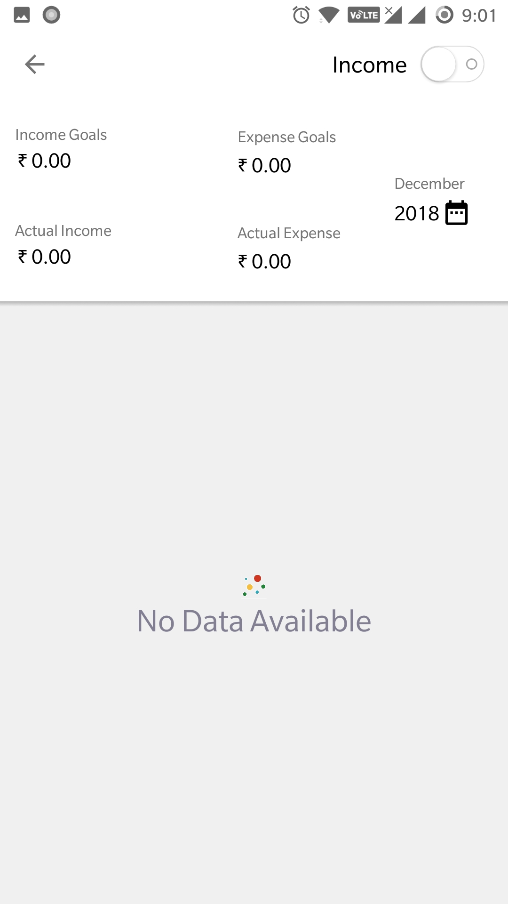

# Personal-Assistant Focus on Budget

####Budget is a **Personal Assistant** budget management Android application.
## **Captured images Walkthrough**:
  

## **Captured images UserManagement**:
  

## **Captured images Dashboard Management**:
  
- ## **Captured images Goals Management**:
  
## **Captured images Add Income**:
  
## **Captured images Add Income Dashboard**:
 
## **Captured images Add Expense **:
   
## **Captured images Dashboard Management **:
  
